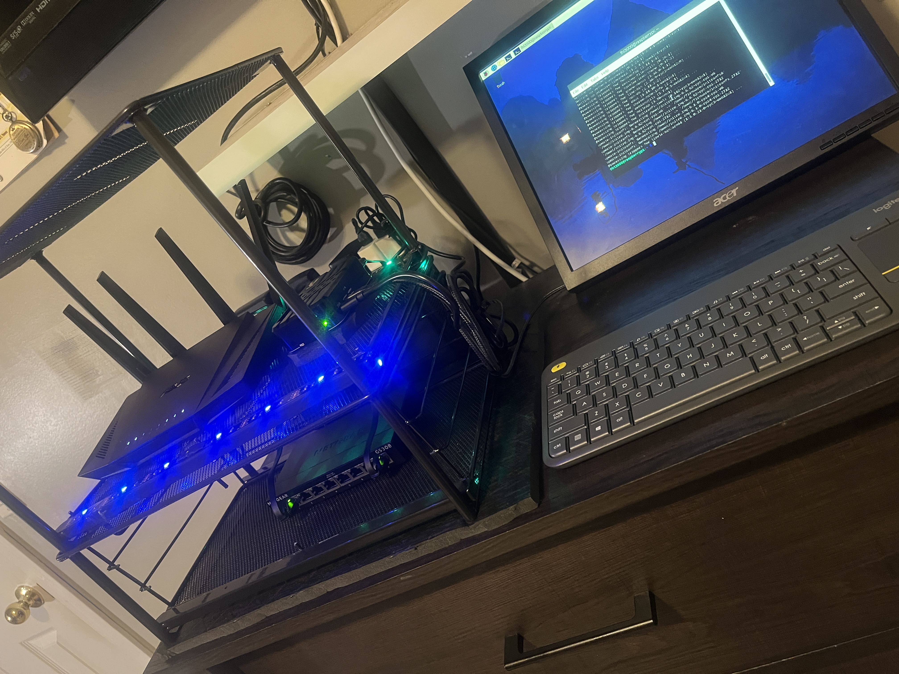
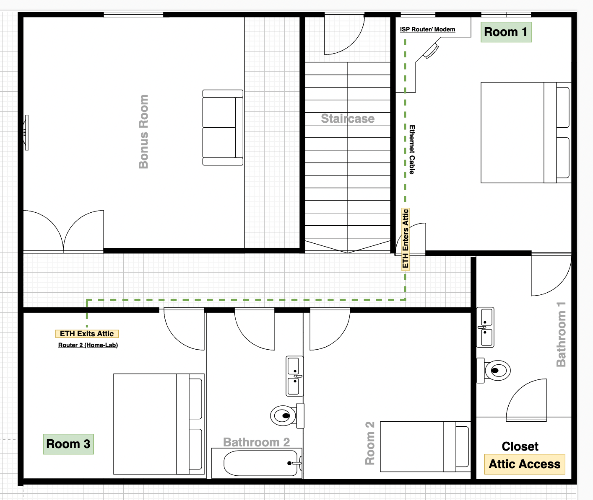
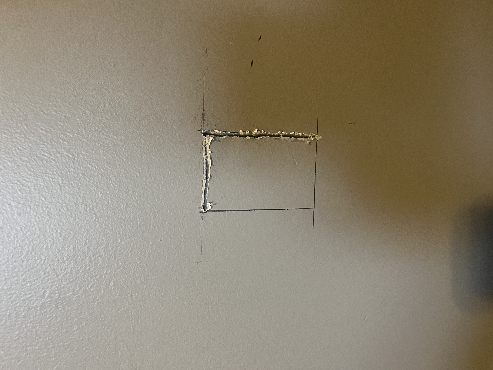
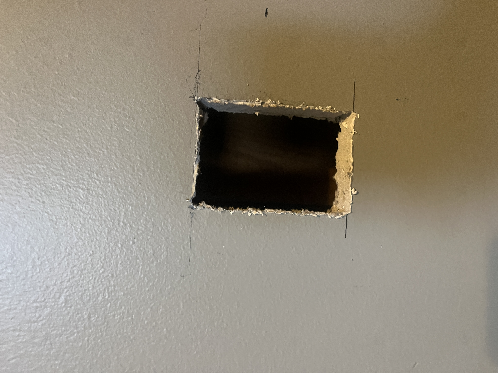
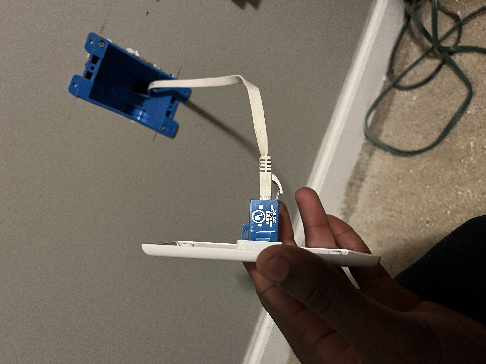
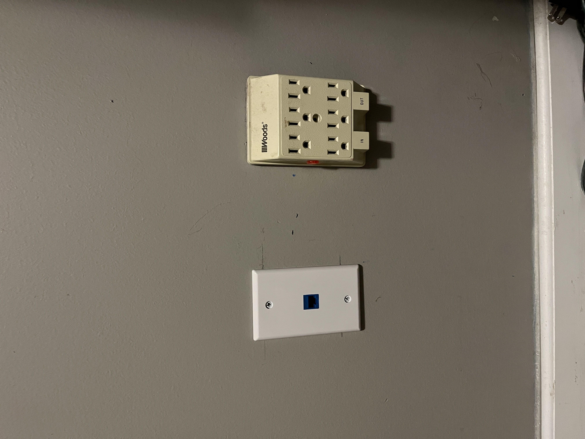
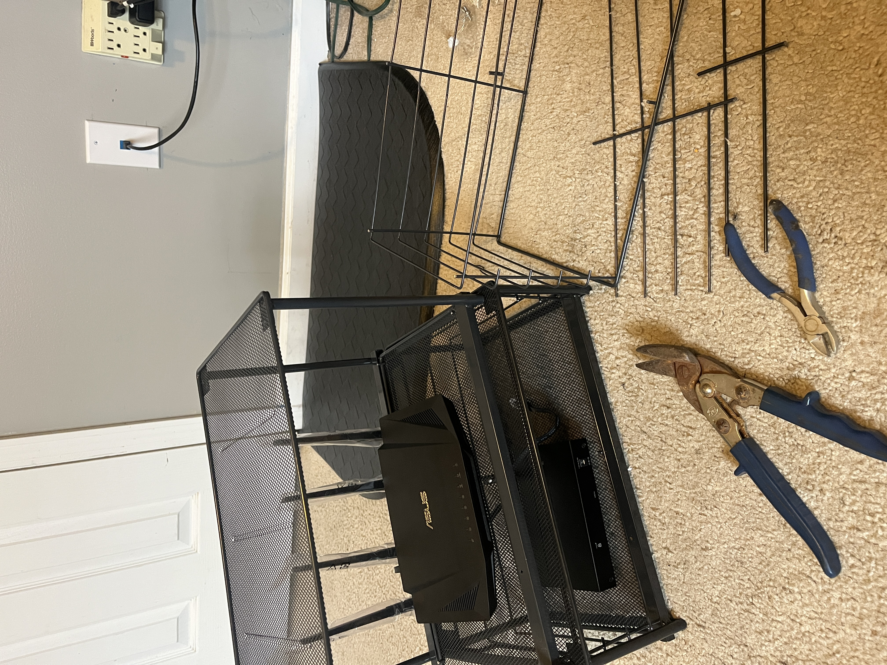

# Home Lab Networking Project

## Overview
This repository documents my home lab project, created to develop practical IT support skills in troubleshooting, system administration, network monitoring, and end-user support. The project leverages a Raspberry Pi, Pi-hole, and custom subnet configurations to simulate real-world IT environments and challenges. This project serves as a hands-on learning experience, demonstrating proficiency in core IT support functions, including problem-solving, system maintenance, and delivering effective support solutions.

### Finished Home Lab
Below is the final setup of my home lab environment.

## Objectives
- Create a secure, isolated sub-network for IT experimentation.
- Gain practical experience with network setup, configuration, and troubleshooting.
- Explore advanced tools like Pi-hole for DNS management and traffic monitoring.

## Equipment
- Raspberry Pi 5 with active and passive cooling case
- ASUS RT-AX3000 WIFI 6 Router
- NETGEAR 8-Port Gigabit Switch
- Logitech K400 Keyboard
- VGA to Micro HDMI Adapter
- 100 ft Flat Ethernet Cat6 Cable & Patch cables
- Ethernet Wall Plate(s)
- Back-UPS

## Configurations
- **Subnet**: 10.0.0.0/24
- **Static IPs**: Assigned for key devices like Raspberry Pi and laptop.
- **DHCP Range**: 10.0.0.50 - 10.0.0.200.
- **Firewall Rules**: Configured UFW on the Raspberry Pi.
- **Pi-hole Integration**: DNS filtering and traffic monitoring.

## Network Diagram
Below is a visual representation of the network setup.

## Ethernet Layout Blueprint
Below is the basic blueprint of the Ethernet cable routing throughout the home.

 

## Logs
- [Ping Test Results](./logs/ping-test-results.log)
- [Traceroute Results](./logs/traceroute-test.log)
- [Pi-hole DNS Queries](./logs/pihole-dns-queries.log)

## Configurations
- [Router Configuration](./configs/router-config.txt)
- [DHCP Settings](./configs/dhcp-settings.txt)
- [Firewall Rules](./configs/ufw-rules.txt)
- [Pi-hole Blocklist](./configs/pihole-blocklist.txt)

## Challenges and Solutions
Throughout the project, I encountered several challenges that required creative problem-solving. Here are some examples:

### Challenge 1: Routing Ethernet Cables
- **Problem**: Extending an Ethernet cable discreetly from the ISP router in one room to the secondary router in another room while avoiding visible wires.
- **Solution**: Used cable fish tape to run the Ethernet cable through interior walls, routing it via the attic and exiting cleanly into the home lab room.

### Challenge 2: DNS Configuration Issues
- **Problem**: Pi-hole was not resolving DNS queries correctly, causing intermittent connectivity issues.
- **Solution**: Verified and corrected the DNS servers and `/etc/resolv.conf` file. Restarted the DNS service and tested functionality with `ping` and `nslookup`.

### Challenge 3: Packet Loss
- **Problem**: Initial tests showed up to 10% packet loss when pinging the Raspberry Pi from other devices.
- **Solution**: Identified DNS misconfigurations as the root cause and resolved the issue by updating Pi-hole settings and restarting network services.

### Challenge 4: Accessing the Router’s Web Interface
- **Problem**: Could not access the router's web interface using `router.asus.com`.
- **Solution**: Proper DNS configuration resolved DNS resolution issues.

## Skills Gained
- Troubleshooting and Diagnostics: Identified and resolved issues related to network connectivity, DNS queries, and system performance, replicating common IT support scenarios.
- System Administration: Configured and maintained a Raspberry Pi as a dedicated DNS server with Pi-hole, including regular updates, backups, and performance tuning.
- Network Monitoring: Monitored network traffic and analyzed DNS queries to identify potential issues, optimize performance, and enhance system reliability.
- Simulated common IT support task, such as diagnosing network connectivity issues, resolving DNS-related problems, and improving system performance

## Future Plans
- Implement VLANs for additional network segmentation.
- Explore automated monitoring tools.
- Expand the lab with cloud-based integrations.
- Further advanced network configuration and penetration testing

## Contact
Feel free to connect with me on [LinkedIn](https://www.linkedin.com/in/kendric-cuthbertson-9626b5210/) or explore more of my projects on GitHub

## Gallery
Below are images and a video showcasing various stages of the project. For additional setup images, visit the [images/](./images/) folder in this repository.

### Faceplate Installation
1. **Measuring for Faceplate Installation**  
   

2. **Cutting the Faceplate Opening**  
   

3. **Horizontal Cable Run**  
   

4. **Finished Faceplate Installation**  
   

### Device Rack Setup
5. **Repurposed Device Rack with LED Lighting**  
   

### DNS Troubleshooting
6. **Initial DNS Loop Problem**  
   

7. **Resolved DNS Loop Issue**  
   

For more detailed visuals, check out the [images/](./images/) folder.
